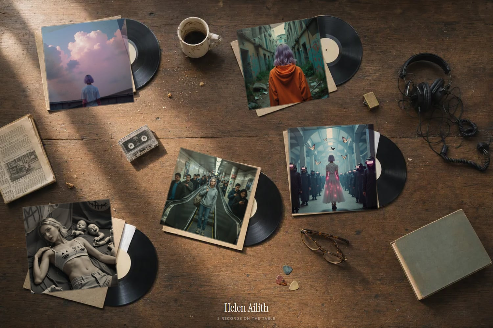

# Record Table

[English](README.md) · **Português** · [Site](https://www.sapiensinteticos.com/record-table?lang=pt)

Uma página que parece uma foto de discos em cima de uma mesa. Passa o mouse e a
capa sobe. Clica e ela sai da mesa, gira e abre com o player do Spotify
funcionando.

[](https://www.sapiensinteticos.com/record-table?lang=pt)

O jeito mais rápido de montar a sua: cola isso no Claude, ChatGPT, Gemini,
Cursor ou Codex, junto com o seu link do Spotify.

```
Usa sapiensinteticos.com/record-table pra botar meus discos numa mesa.
```

O truque é que a fotografia *é* a interface. Uma foto gerada de capas de
papelão **em branco** vira um tabuleiro com coordenada conhecida. A capa de
verdade entra por cima, e aí a textura da própria foto volta sobre a arte duas
vezes: `multiply` pra dobra e pra sombra, `screen` pra fibra clara do papel que
a tinta nunca esconde. Com uma passada parece transparência colada por cima.
Com duas, parece impresso naquela capa.

Cada capa tem o disco meio pra fora, porque um quadrado de arte solto na
madeira parece pôster, e com um disco preto atrás parece álbum.

Uma foto serve todo artista. Disco novo não custa nada.

Vêm dois tabuleiros. O padrão é o bagunçado: cinco capas em ângulos soltos, com
uma caneca de café frio, fone embolado e uma fita cassete nos vãos, porque quase
ninguém tem doze discos e uma grade arrumada com sete buracos parece defeito.
`?board=grid` dá a grade 4x3 de doze, pra discografia que tem tamanho pra isso.

## Começo rápido

```bash
git clone https://github.com/inhabitants/record-table
cd record-table

# 1. app grátis em developer.spotify.com/dashboard, depois:
export SPOTIFY_ID=...  SPOTIFY_SECRET_KEY=...

# 2. monta a mesa
node build.mjs artist "Minha Banda" --slots 5
node build.mjs artist "Minha Banda" --near "Portishead,Massive Attack" --slots 5
node build.mjs mix "In Rainbows" "Back To Black" "Clube da Esquina" --slots 5
node build.mjs artist "Radiohead" --slots 12   # com ?board=grid

# 3. dobra tudo num arquivo só e abre
node bundle.mjs        # -> dist/index.html, uns 300 KB
```

O `dist/index.html` carrega os próprios dados e a própria foto, então abre com
dois cliques, vai anexado num email e sobe em qualquer lugar que aceite arquivo
estático. Sem servidor, sem build, nada do lado.

Pra pôr no ar, qualquer um destes:

```bash
npx surge dist/                  # pede um email e devolve um link
npx vercel deploy --prod dist/
# ou arrasta a pasta dist em app.netlify.com/drop
```

Enquanto você ajusta, `npx serve .` e o `table.html` é o caminho mais rápido:
sem empacotar a cada mudança.

A mesa do site é o `examples/helen-ailith.json`, e ela remonta sem chave do
Spotify: `node bundle.mjs --data examples/helen-ailith.json`.

Sem framework, sem build, sem banco, ninguém faz login. Três arquivos fazem o
trabalho: `build.mjs`, `table.html`, `board.webp`.

O `SKILL.md` é a mesma coisa escrita pra um agente: passa o link e diz "segue
isso". Ele traz o prompt que gera um tabuleiro novo, a lista de motores de
reserva, como medir as capas de novo e o estado atual da API do Spotify
(`related-artists` e `top-tracks` dão 403 na cota padrão desde setembro de
2026, e a listagem de álbuns para em `limit=10`).

## Estado

Publicado como artefato, não como produto: MIT, sem suporte, sem roadmap, sem
promessa. É meio cru de propósito. Faz um fork, quebra, põe a sua foto embaixo.
Issue pode ficar sem resposta.

## Créditos

A busca de artistas parecidos usa o [MusicBrainz](https://musicbrainz.org) e o
[ListenBrainz](https://listenbrainz.org), os dois abertos e sem chave. Capas,
metadados e player vêm do Spotify.

Feito no [Sapiens Sintéticos](https://sapiensinteticos.com), um lab de
aprendizado personalizado e prototipagem.

MIT.
